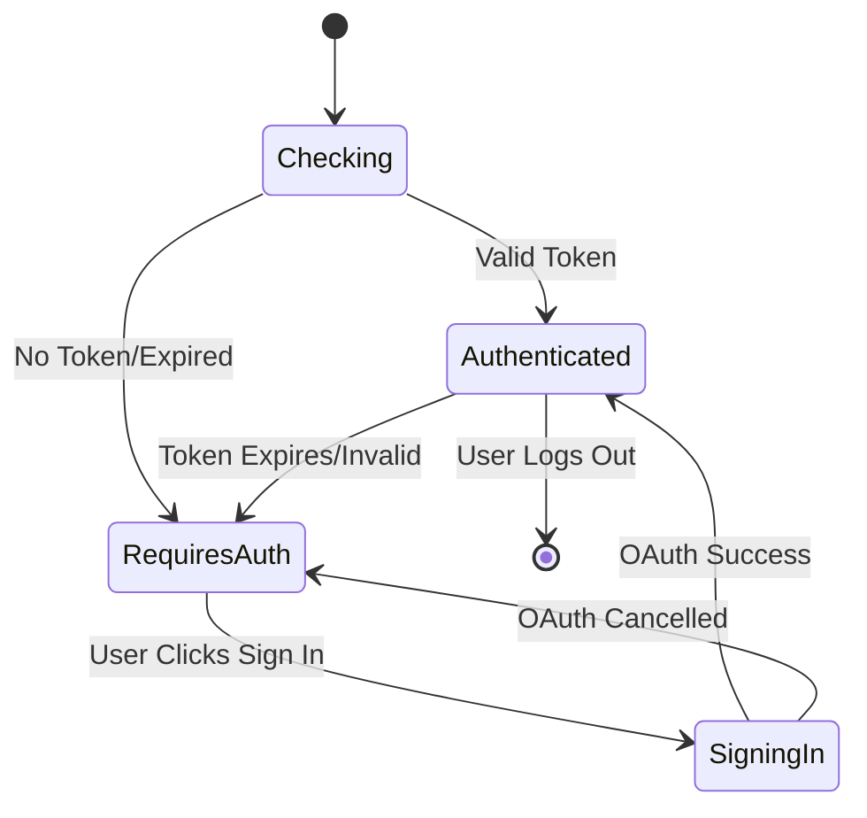

# Clarivue Platform Integration Guide

## 🎯 Overview

The Clarivue Google Meet add-on now integrates with your Clarivue platform accounts, ensuring only authenticated Clarivue users can access the enhanced meeting features. This creates a seamless experience where the add-on naturally appears in Google Meet for your users.

## 🔐 Authentication Flow

### How It Works

1. **User opens Google Meet add-on** → Add-on checks for Clarivue authentication
2. **No authentication found** → Display Clarivue sign-in card
3. **User clicks "Sign In to Clarivue"** → Opens OAuth flow in overlay
4. **User authenticates** → Receives JWT token from your platform
5. **Token stored in Google Apps Script** → User properties for secure storage
6. **Add-on loads with full features** → Personalized experience based on plan
7. **API calls authenticated** → All requests include Bearer token
8. **Meeting data synced** → Sessions tracked on your platform

### Authentication States



## 🏗️ Architecture

### Google Apps Script Integration

```javascript
// Core authentication check
function checkClarivueAccount() {
  const userEmail = Session.getActiveUser().getEmail();
  const authToken = PropertiesService.getUserProperties().getProperty('clarivue_auth_token');
  
  if (authToken && !isTokenExpired()) {
    return verifyClarivueAccount(userEmail, authToken);
  }
  
  return { isAuthenticated: false, requiresAuth: true, userEmail };
}

// Platform API verification
function verifyClarivueAccount(userEmail, authToken) {
  const response = UrlFetchApp.fetch('https://api.clarivue.com/v1/auth/verify', {
    headers: { 'Authorization': `Bearer ${authToken}` }
  });
  
  const data = JSON.parse(response.getContentText());
  return data.valid ? { 
    isAuthenticated: true, 
    userInfo: data 
  } : { 
    isAuthenticated: false, 
    requiresAuth: true 
  };
}
```

### React Frontend Integration

```typescript
// Authentication hook
const { 
  user, 
  isAuthenticated, 
  isLoading,
  hasFeature,
  login,
  logout 
} = useClarivueAuth();

// Feature-based rendering
if (hasFeature('tone-analysis')) {
  return <ToneIndicator />;
}

if (user?.planType === 'enterprise') {
  return <AdvancedAnalytics />;
}
```

## 🛠️ Backend Requirements

### Required API Endpoints

Your Clarivue backend must implement these authentication endpoints:

#### 1. Authentication Verification
```http
GET /v1/auth/verify
Authorization: Bearer {jwt_token}

Response:
{
  "valid": true,
  "accountId": "user_123",
  "planType": "pro",
  "features": ["tone-analysis", "ai-suggestions"],
  "displayName": "John Doe",
  "email": "john@company.com"
}
```

#### 2. Google Meet Login Flow
```http
GET /auth/google-meet-login?email={user_email}&return_to=google_meet_addon

Redirects to OAuth provider, then returns:
{
  "action": "auth_success",
  "authToken": "jwt_token_here",
  "expiryTime": "2024-01-01T00:00:00Z",
  "userInfo": { ... }
}
```

#### 3. Meeting Session Management
```http
POST /v1/meetings/sessions
Authorization: Bearer {jwt_token}

Body:
{
  "meetingId": "meet_abc123",
  "userId": "user_123",
  "userEmail": "john@company.com",
  "startTime": "2024-01-01T10:00:00Z",
  "organizerEmail": "jane@company.com"
}
```

#### 4. Meeting Data Sync
```http
DELETE /v1/meetings/sessions/{meetingId}
Authorization: Bearer {jwt_token}

Body:
{
  "endTime": "2024-01-01T11:00:00Z",
  "duration": 3600,
  "participants": ["user_123", "user_456"]
}
```

## 📱 User Experience

### For Unauthenticated Users

When a user opens the Google Meet add-on without a Clarivue account:

1. **Welcome Card Displayed**
   - Clarivue branding and value proposition
   - "Sign In to Clarivue" primary button
   - "Create Clarivue Account" secondary button

2. **OAuth Flow**
   - Opens in overlay/popup window
   - Redirects to your authentication system
   - Supports Google SSO, email/password, etc.

3. **Post-Authentication**
   - Automatic token storage in Apps Script
   - Panel refreshes with full features
   - Welcome message with user's name

### For Authenticated Users

When a user opens the add-on with a valid Clarivue account:

1. **Immediate Access**
   - No authentication prompts
   - Personalized welcome message
   - Features based on plan type

2. **Plan-Based Features**
   - **Free Plan**: Basic questions and cues
   - **Pro Plan**: + Tone analysis
   - **Enterprise Plan**: + AI suggestions + Advanced analytics

3. **Seamless Integration**
   - Meeting sessions automatically tracked
   - Data synced to Clarivue dashboard
   - Settings accessible via gear icon

## 🔧 Implementation Steps

### 1. Update Your Backend

```javascript
// Add authentication endpoints
app.get('/v1/auth/verify', authenticateToken, (req, res) => {
  res.json({
    valid: true,
    accountId: req.user.id,
    planType: req.user.planType,
    features: req.user.features,
    displayName: req.user.displayName,
    email: req.user.email
  });
});

app.get('/auth/google-meet-login', (req, res) => {
  const { email, return_to } = req.query;
  // Implement OAuth flow
  // Return to: Apps Script webapp URL with auth data
});
```

### 2. Deploy Updated Apps Script

```bash
# Copy the updated Code.gs and appsscript.json
# Deploy as web app with these settings:
# - Execute as: User accessing the web app
# - Who has access: Anyone within your domain
```

### 3. Configure Environment

```bash
# In your Clarivue backend
GOOGLE_APPS_SCRIPT_WEB_APP_URL=https://script.google.com/macros/s/{script_id}/exec
GOOGLE_MEET_ADDON_REDIRECT_URI=https://script.google.com/macros/s/{script_id}/exec

# For React frontend
REACT_APP_API_BASE_URL=https://api.clarivue.com
REACT_APP_ENABLE_CLARIVUE_AUTH=true
```

### 4. Test Authentication Flow

1. **Deploy add-on** to test Google Workspace domain
2. **Open Google Meet** and start a meeting
3. **Open Clarivue add-on** from side panel
4. **Verify authentication prompt** appears for new users
5. **Test sign-in flow** completes successfully
6. **Confirm features** load based on user plan

## 🔒 Security Considerations

### Token Management

- **Storage**: JWT tokens stored in Google Apps Script User Properties (secure, per-user)
- **Expiration**: Tokens expire automatically, users re-authenticate as needed
- **Validation**: Every API call validates token server-side
- **Revocation**: Users can revoke access via Clarivue account settings

### Data Privacy

- **Minimal Data**: Only necessary user info stored (email, plan, features)
- **Meeting Privacy**: Meeting content not transmitted unless user explicitly shares
- **Audit Trail**: All API calls logged with user consent
- **GDPR Compliance**: Users can delete all data via account settings

### Domain Security

- **OAuth Scopes**: Minimal required permissions only
- **Domain Restriction**: Add-on limited to your organization's domain
- **HTTPS Only**: All API communications encrypted
- **Rate Limiting**: Prevent abuse with request limits

## 📊 Analytics & Monitoring

### User Adoption Tracking

```javascript
// Track authentication events
analytics.track('google_meet_addon_auth', {
  user_id: userInfo.accountId,
  plan_type: userInfo.planType,
  auth_method: 'oauth',
  source: 'google_meet'
});

// Track feature usage
analytics.track('feature_used', {
  feature: 'tone_analysis',
  platform: 'google_meet',
  user_plan: userInfo.planType
});
```

### Meeting Analytics

```javascript
// Track meeting sessions
{
  "session_id": "meet_abc123",
  "user_id": "user_123", 
  "duration_minutes": 45,
  "questions_used": 3,
  "cues_applied": 2,
  "tone_analysis_enabled": true
}
```

## 🚀 Deployment Checklist

### Pre-Deployment

- [ ] Backend authentication endpoints implemented
- [ ] OAuth flow configured and tested
- [ ] JWT token validation working
- [ ] Google Apps Script webapp deployed
- [ ] Domain security settings configured

### Testing

- [ ] New user authentication flow
- [ ] Existing user automatic sign-in
- [ ] Token expiration and refresh
- [ ] Feature access by plan type
- [ ] Meeting session tracking
- [ ] Error handling and recovery

### Production

- [ ] SSL certificates configured
- [ ] Rate limiting enabled
- [ ] Monitoring and alerting setup
- [ ] Privacy policy updated
- [ ] User documentation created
- [ ] Support team trained

## 📚 Troubleshooting

### Common Issues

**"Authentication Failed"**
- Check backend endpoint availability
- Verify JWT token format and expiration
- Confirm OAuth redirect URLs match

**"Features Not Loading"**
- Validate user plan and feature flags
- Check API endpoint responses
- Verify user permissions

**"Add-on Not Appearing"**
- Confirm Google Apps Script deployment
- Check domain restrictions
- Verify add-on installation for user

### Debug Mode

Enable debug logging in Apps Script:

```javascript
// Add to Code.gs for troubleshooting
function debugAuth() {
  const properties = PropertiesService.getUserProperties();
  console.log('Stored token:', properties.getProperty('clarivue_auth_token'));
  console.log('Token expiry:', properties.getProperty('clarivue_token_expiry'));
  console.log('User email:', Session.getActiveUser().getEmail());
}
```

## 🔮 Future Enhancements

### Planned Features

- **Single Sign-On (SSO)**: Enterprise SSO integration
- **Role-Based Access**: Team admin controls
- **Advanced Analytics**: Usage insights dashboard
- **Custom Branding**: White-label options for enterprise
- **API Webhooks**: Real-time event notifications

### Integration Roadmap

- **Zoom Integration**: Unified auth across platforms
- **Teams Integration**: Microsoft SSO support
- **Slack Integration**: Meeting summaries to channels
- **Calendar Integration**: Pre-meeting prep suggestions

---

**Need Help?** Contact the Clarivue development team at `dev@clarivue.com` for implementation support. 